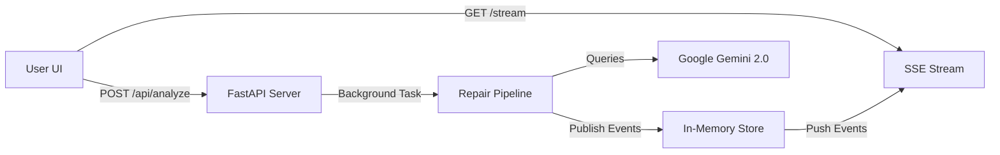

# Fixer - Visual Workflow & Architecture Guide

This document provides a comprehensive, step-by-step breakdown of how the **Fixer** AI Reliability Engineer works, from the moment a user clicks "Analyze" to the generation of a code fix.

---

## 1. High-Level Architecture

The system follows an **Event-Driven Architecture** using a React frontend for visualization and a Python/FastAPI backend for orchestration.

---

## 2. Detailed Workflow Steps

### Phase 1: Initiation & Ingestion
Gemini
1.  **User Action**: The user submits a Github URL (e.g., `https://github.com/user/repo`) or selects "Demo Mode" (`demo://quickcart`).
2.  **API Handling** (`backend/app/main.py`):
    *   The `/api/analyze` endpoint accepts the request.
    *   It generates a unique `analysis_id`.
    *   It initializes an empty `Analysis` object in the global `AnalysisStore`.
    *   It triggers `run_pipeline` as a **Background Task** (fire-and-forget).
    *   It immediately returns the `analysis_id` to the frontend.
3.  **Frontend Reaction** (`frontend/src/app/analysis/[id]/page.tsx`):
    *   The UI navigates to the analysis page.
    *   It opens a **Server-Sent Events (SSE)** connection to `/api/analysis/{id}/stream`.
    *   While waiting for data, it displays **Skeleton Loaders** to indicate background activity.

### Phase 2: The Repair Pipeline (Backend)

The pipeline logic resides in `backend/app/pipeline.py` and executes efficiently in 4 stages:

#### **Stage 1: Fetching Logs & Ingestion**
*   **Goal**: Get the code and find the error.
*   **Action**:
    *   **Cloning**: Uses `git clone` to download the repository to a temporary directory.
    *   **Indexing**: Splits Python files into searchable "chunks" (logic in `IngestPipeline`).
    *   **Log Fetching**: Connects to MongoDB to find recent Exceptions, or uses a local `runtime_logs.jsonl` file in demo mode.
*   **Data Flow**:
    *   The fetched errors are **immediately saved** to the `AnalysisStore`.
    *   An event `fetching_logs: completed` is published.
    *   **Crucial Detail**: The payload includes the full list of errors.

#### **Stage 2: Retrieving Code (Context Retrieval)**
*   **Goal**: Find the code responsible for the crash.
*   **Action**:
    *   The `PromptAssembler` class takes the stack trace from the error.
    *   It scans the indexed code chunks.
    *   It scores chunks based on keyword matches (e.g., matching filenames in the stack trace get a massive score boost).
*   **Outcome**: The top 15 most relevant code snippets are selected as "context."

#### **Stage 3: Diagnosing (The AI Agent)**
*   **Goal**: Understand *why* it broke.
*   **Tools**: `DiagnosisAgent` + `LLMClient`.
*   **Process**:
    *   A prompt is constructed containing:
        *   The Error Message & Stack Trace.
        *   The 15 Retrieval Code Chunks.
        *   A "System Instruction" enforcing a strict JSON output format.
    *   **LLM Call**: The request is sent to **Google Gemini 2.0 Flash** via OpenRouter.
    *   **Reasoning**: The AI performs "Chain-of-Thought" analysis (Analyze -> Localize -> Explain -> Fix).
*   **Streaming**: The "Root Cause" text is streamed word-by-word to the frontend for a "typing" effect.

#### **Stage 4: Generating Fix**
*   **Goal**: Create a patch.
*   **Action**: The AI's JSON response is parsed to extract:
    *   `affected_file`: The exact file path.
    *   `affected_line`: The line number.
    *   `fix_suggestion`: The valid Python code to replace the buggy segment.
*   **Completion**: The final diagnosis is marked as `completed` and stored.

---

## 3. Data & State Management

### Backend Storage (`backend/app/store.py`)
*   **Type**: In-Memory Dictionary (`Dict[str, Analysis]`).
*   **Purpose**: Acts as a high-speed message broker between the background pipeline and the HTTP streaming endpoint.
*   **Persistence Strategy**:
    *   Data is transient (lost on server restart).
    *   This is sufficient for a real-time debugging session.

### Frontend Store (`frontend/src/lib/store.ts`)
*   **Library**: **Zustand**.
*   **Role**:
    *   Receives SSE events.
    *   Updates the `stages` (e.g., marking "Fetching Logs" as done).
    *   Updates the `liveDiagnosis` object which drives the UI.
    *   **Smart Merging**: It merges partial updates (e.g., just the error list, then just the root cause) into a cohesive state object.

---

## 4. Key Technical Solutions

### 1. The "Empty Screen" Race Condition
*   **Problem**: The backend is fast. Sometimes Stage 1 finishes *before* the Frontend connects to the stream. The Frontend would miss the "Here are the errors" message and show nothing.
*   **Fix**: **Stream Replay**.
    *   When a client connects to `/stream`, the backend checks: "Do I already have errors for this ID?"
    *   If yes, it immediately sends a synthetic event containing those errors *before* listening for new events.
    *   Result: The UI always populates, regardless of connection timing.

### 2. LLM Reliability
*   **Problem**: Large Contexts & timeouts.
*   **Solution**:
    *   Use **Gemini 2.0 Flash**: Supports 1M+ tokens, allowing us to send many code chunks without truncation.
    *   **Retry Logic**: The `LLMClient` implements exponential backoff on `429` (Rate Limit) errors.
    *   **JSON Enforcement**: The prompt explicitly requires strict JSON, preventing markdown parsing errors.

### 3. Visual Feedback
*   **Skeleton Screens**: Added to `AnalysisDetailPage`. Usage of conditional rendering ensures users know the system is "thinking" even before the first byte of data arrives.
